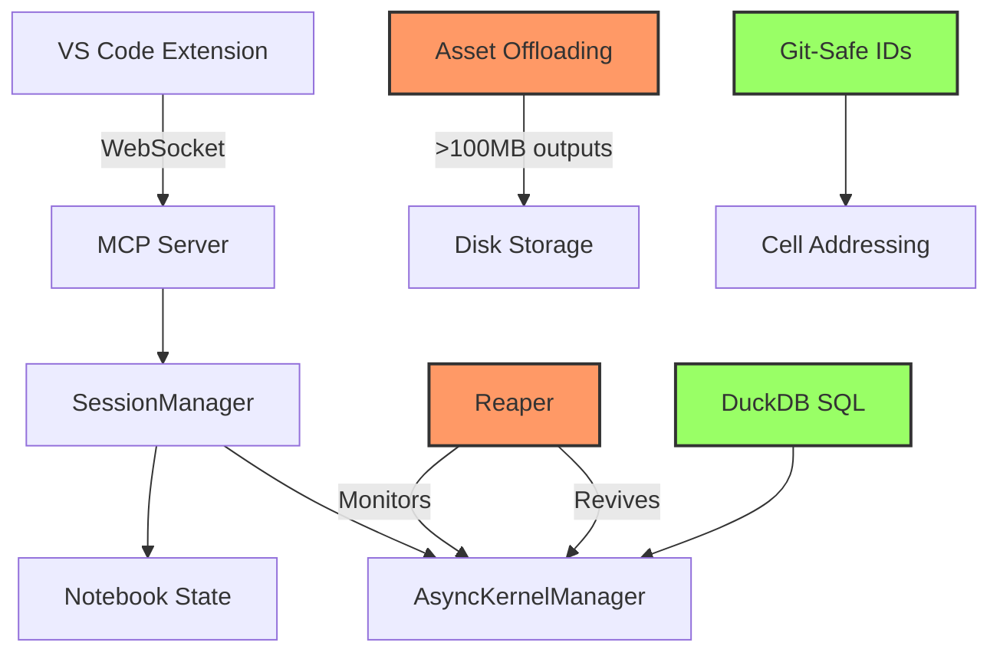

# MCP Jupyter Server

<div align="center">

[](https://badge.fury.io/py/mcp-server-jupyter)
[](https://github.com/yourusername/mcp-jupyter-server/actions)
[](https://yourusername.github.io/mcp-jupyter-server)
[](https://opensource.org/licenses/MIT)
[](https://www.python.org/downloads/)
[](https://marketplace.visualstudio.com/items?itemName=yourpublisher.mcp-agent-kernel)

**Production-grade Jupyter with Superpowers: SQL queries on DataFrames, Auto-EDA, Git-Safe Workflows, and AI Agent tools**

[**📖 Documentation**](https://yourusername.github.io/mcp-jupyter-server) | [**🚀 Quick Start**](#quick-start) | [**✨ Superpowers**](#superpowers) | [**🔥 Try in Codespaces**](https://github.com/codespaces/new?repo=yourusername/mcp-jupyter-server)

</div>

---

## The One-Line Pitch

**Standard Jupyter crashes. Outputs freeze browsers. Agents struggle. MCP Jupyter Server solves this.**

```bash
# The "Trust Me" Install
pip install "mcp-server-jupyter[superpowers]" && code --install-extension mcp-agent-kernel
```

[](https://github.com/codespaces/new?repo=yourusername/mcp-jupyter-server)

---

## The Problem

<table>
<tr>
<td width="50%">

**Standard Jupyter**

```python
# Complex pandas GROUP BY (8-12 lines)
result = (df.groupby(['region', 'product'])
            .agg({'revenue': 'sum', 'units': 'sum'})
            .reset_index()
            .sort_values('revenue', ascending=False)
            .head(10))

# Kernel crashes → lose all work
# 100MB output → browser freezes
# EDA → 30 minutes of boilerplate
```

</td>
<td width="50%">

**MCP Jupyter (With Superpowers)**

```python
# SQL query (1 line, 10x easier)
query_dataframes("""
    SELECT region, SUM(revenue) as total
    FROM df GROUP BY region
    ORDER BY total DESC LIMIT 10
""")

# Kernel crashes → auto-recovery (Reaper)
# 100MB output → asset offloading (no freeze)
# EDA → /prompt auto-analyst (60 seconds)
```

</td>
</tr>
</table>

---

## Superpowers

### 🎯 DuckDB SQL: Query DataFrames Like a Database

```python
# Before: Verbose pandas
grouped = df[df['age'] > 25].groupby('city')['income'].mean().sort_values(ascending=False)

# After: Clean SQL
query_dataframes("SELECT city, AVG(income) FROM df WHERE age > 25 GROUP BY city ORDER BY AVG(income) DESC")
```

**Why**: Zero-copy in-memory SQL. 10x more readable. Familiar syntax for SQL users.

### 📊 Auto-EDA: 60-Second Exploratory Data Analysis

```python
/prompt auto-analyst
```

**Generates**:

- Data health check (missing values, outliers)
- 3+ visualizations (distributions, correlations, trends)
- Statistical summary with recommendations

**Why**: Eliminates 30 minutes of matplotlib/seaborn boilerplate.

### 🔄 Git-Safe Workflows: Stable Cell IDs for Version Control

```python
# Cell IDs persist across sessions (nbformat 4.5)
get_notebook_outline("analysis.ipynb")  # Returns stable IDs
edit_cell(id="abc-123", content="...")  # Works after git pull
```

**Why**: Reliable notebook addressing survives server restarts and git operations. Enables team collaboration without merge conflicts.

---

## Why MCP Jupyter Wins

| Feature | Standard Jupyter | JupyterLab | Datalayer | **MCP Jupyter** |
|---------|------------------|------------|-----------|-----------------|
| **Kernel Crash Recovery** | ❌ Manual restart | ❌ Manual restart | ⚠️ Partial | ✅ **Automatic (Reaper)** |
| **100MB Outputs** | ❌ Browser crash | ⚠️ Slow render | ✅ | ✅ **Asset offloading** |
| **SQL on DataFrames** | ❌ | ❌ | ❌ | ✅ **DuckDB (zero-copy)** |
| **Auto-EDA** | ❌ 30min manual | ❌ 30min manual | ❌ | ✅ **60-second AI** |
| **Git-Safe Cell IDs** | ❌ | ❌ | ❌ | ✅ **nbformat 4.5** |
| **Agent Tools** | ⚠️ 5-10 basic | ⚠️ 5-10 basic | ⚠️ 10-15 | ✅ **32 specialized** |
| **Consumer Prompts** | ❌ | ❌ | ❌ | ✅ **3 pre-built personas** |
| **Offline Install** | ✅ | ✅ | ❌ Requires cloud | ✅ **Fat VSIX (26MB)** |
| **Real-Time Collab** | ❌ | ⚠️ Extension | ✅ **Built-in** | ⚠️ Planned |

**[📊 Full Comparison Table →](https://yourusername.github.io/mcp-jupyter-server/comparison/jupyter/)**

---

## Quick Start

### 1. Install (One Command)

```bash
pip install "mcp-server-jupyter[superpowers]"
```

### 2. Try It Instantly (GitHub Codespaces)

[](https://github.com/codespaces/new?repo=yourusername/mcp-jupyter-server)

**Zero setup required.** Codespaces pre-installs everything: Python server, VS Code extension, demo notebooks.

### 3. Or Run Locally (VS Code)

1. **Install VS Code Extension**:
   - Open Extensions (`Ctrl+Shift+X`)
   - Search "MCP Agent Kernel"
   - Click Install

2. **Open a Notebook**:
   ```bash
   code demo.ipynb
   ```

3. **Select Kernel**:
   - Click kernel selector (top-right)
   - Choose "MCP Agent Kernel"

4. **Try a Superpower**:
   ```python
   /prompt auto-analyst
   ```

---

## Architecture: The Crucible

Standard Jupyter kernels crash and lose state. **MCP Jupyter has the Reaper**.



**What Makes It Bulletproof**:

- **Reaper**: Auto-restarts crashed kernels in <2 seconds
- **Asset Offloading**: 100MB+ outputs stream to disk (no browser freeze)
- **Error Recovery**: Self-healing on bad code
- **Output Truncation**: Massive logs handled gracefully

**[🏗️ Architecture Deep Dive →](https://yourusername.github.io/mcp-jupyter-server/architecture/crucible/)**

---

## Real-World Use Cases

### Data Science

```python
# Load 50M row dataset
df = pd.read_parquet("huge_dataset.parquet")  # Takes 5 minutes

# Try complex analysis (with auto-recovery)
result = df.merge(other_df).groupby(...).apply(custom_func)

# If kernel crashes → Reaper restarts automatically in <2s
# Notebook state preserved via atomic writes + git-safe Cell IDs
```

### LLM Agent Development

```python
# Agent-ready tools (32 available)
truncate_output(massive_log)  # Context window protection
inspect_variable("df")  # JSON metadata (not full df)
search_notebook("TODO")  # Grep without loading file
install_package("scikit-learn")  # Smart pip with sys.executable
```

### Business Intelligence

```python
# SQL instead of pandas (familiar syntax for SQL users)
query_dataframes("""
    SELECT product_category,
           COUNT(*) as transactions,
           SUM(revenue) as total_revenue,
           AVG(profit_margin) as avg_margin
    FROM sales_data
    WHERE transaction_date >= '2024-01-01'
    GROUP BY product_category
    HAVING total_revenue > 100000
    ORDER BY total_revenue DESC
""")
```

---

## Consumer Prompts for Claude Desktop

Pre-built personas for common workflows:

```python
# 1. Safe Co-Pilot
/prompt jupyter-expert
# Uses detect_sync_needed, prefers edit_and_run_cell, never drops cells

# 2. Autonomous Researcher
/prompt autonomous-researcher
# OODA loop: Observe → Orient → Decide → Act
# Self-healing, no memory bombs

# 3. Auto-Analyst
/prompt auto-analyst
# 60-second EDA: health check, plots, correlations, recommendations
```

**[🤖 Full Prompt Documentation →](https://yourusername.github.io/mcp-jupyter-server/prompts/)**

---

## Production-Grade Quality

- ✅ **120+ Python unit tests** (all passing)
- ✅ **6 real-world integration tests** (TypeScript ↔ Python ↔ WebSocket)
- ✅ **VSIX verification script** (69 wheels, 26MB, cross-platform)
- ✅ **No deprecation warnings** (Pydantic V2 compliant)
- ✅ **SQL injection safe** (triple-quoted strings, no manual escaping)
- ✅ **Cross-platform tested** (Linux, macOS ARM/Intel, Windows)

**[🧪 Testing Guide →](https://yourusername.github.io/mcp-jupyter-server/development/testing/)**

---

## Documentation

📖 **[Full Documentation](https://yourusername.github.io/mcp-jupyter-server)**

- [Getting Started](https://yourusername.github.io/mcp-jupyter-server/getting-started/installation/)
- [Superpowers Guide](https://yourusername.github.io/mcp-jupyter-server/superpowers/)
- [Architecture Deep Dive](https://yourusername.github.io/mcp-jupyter-server/architecture/)
- [API Reference](https://yourusername.github.io/mcp-jupyter-server/api/session/)
- [Comparison vs Alternatives](https://yourusername.github.io/mcp-jupyter-server/comparison/jupyter/)

---

## Contributing

We welcome contributions! See [CONTRIBUTING.md](CONTRIBUTING.md).

**Quick Start for Contributors**:

```bash
git clone https://github.com/yourusername/mcp-jupyter-server.git
cd mcp-jupyter-server/tools/mcp-server-jupyter
pip install -e ".[superpowers]"
pytest tests/ -v
```

---

## License

MIT License. See [LICENSE](LICENSE) for details.

---

## The Honest Take

**We don't claim to be better at everything.**

- **Real-time collaboration?** Use [Datalayer](https://datalayer.io).
- **Browser-only workflow?** Use [JupyterLab](https://jupyterlab.readthedocs.io).
- **Simple learning?** Standard Jupyter is fine.

**We're better at**:

- 🛡️ Crash recovery
- 📦 Large output handling (>100MB)
- 🤖 AI agent integration
- 🔍 SQL on DataFrames
- ⚡ VS Code workflows

If you need those, **MCP Jupyter is the right choice**.

---

<div align="center">

**Built with ❤️ by the MCP Jupyter community**

[](https://github.com/yourusername/mcp-jupyter-server)
[](https://twitter.com/yourhandle)

</div>
