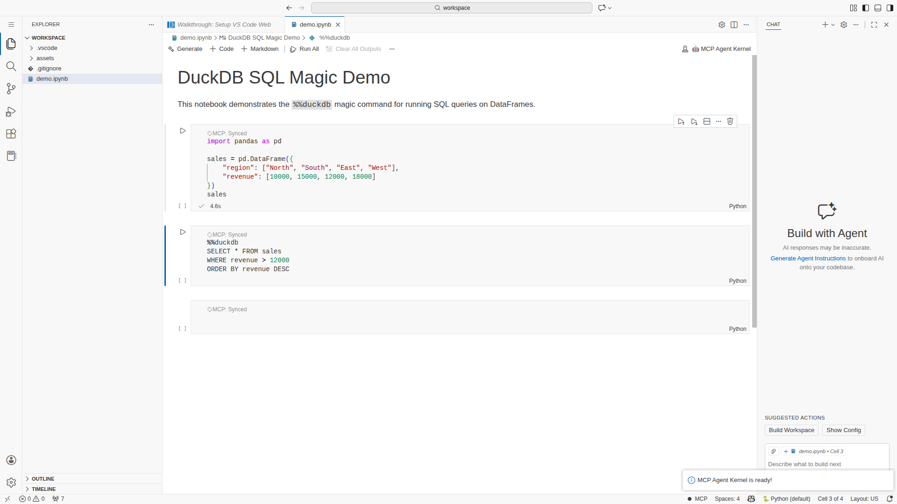

# 🚀 MCP Jupyter Quick Start Guide

<div align="center">

**Get started with MCP Jupyter in 2 minutes!**



*MCP Agent Kernel running in VS Code with DuckDB SQL magic*

</div>

---

## 📺 Video Demo

Watch the full demo of MCP Jupyter in action:

[**▶️ Watch the Full Demo Video**](media/mcp-jupyter-demo.webm)

*Or see the [demo video file](media/mcp-jupyter-demo.webm) in this repository.*

---

## Step 1: Install the Extension

### Option A: VS Code Marketplace (Recommended)

1. Open **VS Code**
2. Press `Ctrl+Shift+X` to open Extensions
3. Search for **"MCP Agent Kernel"**
4. Click **Install**

### Option B: Manual Installation

```bash
# Download and install the VSIX file
code --install-extension mcp-agent-kernel-0.1.0.vsix
```

---

## Step 2: Open a Notebook

1. Open any Jupyter notebook (`.ipynb` file)
2. The extension will automatically set up the MCP Jupyter server


---

## Step 3: Select the MCP Agent Kernel

1. Click the **kernel picker** in the top-right of your notebook
2. Select **"🤖 MCP Agent Kernel"**

You'll see the notification:
> ✅ **MCP Agent Kernel is ready!**

---

## Step 4: Start Using Superpowers!

### 🔹 Run SQL on DataFrames

```python
import pandas as pd

# Create sample data
sales = pd.DataFrame({
    "region": ["North", "South", "East", "West"],
    "revenue": [10000, 15000, 12000, 18000]
})

# Query with SQL!
%%duckdb
SELECT * FROM sales
WHERE revenue > 12000
ORDER BY revenue DESC
```

### 🔹 Auto-EDA in 60 Seconds

```python
/prompt auto-analyst
```

The AI agent will automatically:
- Analyze your data structure
- Generate visualizations
- Provide statistical insights

### 🔹 Variable Dashboard

Open the **MCP Variables** panel in the sidebar to see:
- All variables with their types
- Memory usage per variable
- One-click inspection

---

## 📊 Feature Highlights

| Feature | What It Does |
|---------|--------------|
| **DuckDB SQL** | Query pandas DataFrames with SQL syntax |
| **Auto-EDA** | Generate complete EDA in 60 seconds |
| **Variable Dashboard** | Real-time variable inspection |
| **Crash Recovery** | Automatic kernel restart (Reaper) |
| **Output Offloading** | Handle 100MB+ outputs without freezing |
| **Git-Safe Cell IDs** | Stable cell addressing for version control |

---

## 🎥 More Demos

### DuckDB SQL Magic

The video below shows how to use SQL queries directly on pandas DataFrames:

[**▶️ Watch the DuckDB SQL Demo**](media/mcp-jupyter-demo.webm)

### Variable Dashboard


---

## 🔧 Configuration

### Settings

Add these to your VS Code settings (`settings.json`):

```json
{
  "mcp-jupyter.autoStart": true,
  "mcp-jupyter.showSetupWizard": false,
  "mcp-jupyter.pythonPath": "/usr/bin/python3"
}
```

### Remote Server Connection

To connect to a remote MCP server:

```json
{
  "mcp-jupyter.serverMode": "connect",
  "mcp-jupyter.remoteHost": "your-server.example.com",
  "mcp-jupyter.remotePort": 3000
}
```

---

## 🆘 Troubleshooting

### Server Not Starting?

1. Open Command Palette (`Ctrl+Shift+P`)
2. Run **"MCP Jupyter: Show Server Logs"**
3. Check for error messages

### Connection Issues?

- Verify Python 3.10+ is installed
- Check firewall settings for port 3000
- Ensure dependencies are installed:

```bash
pip install "mcp-server-jupyter[superpowers]"
```

### Local Kubernetes Development (if using kubeconfig)

If you are running the MCP server locally using your cluster kubeconfig (not in-cluster), the server will detect you are not running inside Kubernetes and will default kernel pod connections to `127.0.0.1` to make local workflows predictable. Use `kubectl port-forward` or a VPN/Telepresence to expose the kernel pod port(s) to localhost. This avoids flaky cluster DNS resolution during development and provides a clear local debugging workflow.

Note: In production (in-cluster), MCP uses a headless Service for stable DNS; that behavior is unchanged when the server runs inside the cluster.

### Need Help?

- 📖 [Full Documentation](../README.md)
- 🐛 [Report an Issue](https://github.com/yourusername/mcp-jupyter-server/issues)
- 💬 [Discussions](https://github.com/yourusername/mcp-jupyter-server/discussions)

---

## 🎉 You're Ready!

You now have access to:

- ✅ **32 specialized AI tools** for notebook manipulation
- ✅ **DuckDB SQL** on pandas DataFrames
- ✅ **Auto-EDA** with one command
- ✅ **Crash recovery** and output management
- ✅ **Git-safe workflows** with stable cell IDs

---

## 🧪 Verification Scenarios (Docker)

To see the extension in action programmatically, you can run our automated verification scenarios. These use **Docker** and **Playwright** to mimic a real developer environment.

### 1. Run the Setup
Ensure you have Docker installed, then run:
```bash
cd scripts/demo-recording
./setup-demo.sh
```

### 2. Run a Scenario
Execute any of the pre-defined scenarios to verify results:

| Scenario | Command | What it Verifies |
|----------|---------|-------------------|
| **Setup** | `npx playwright test scenario-01-setup` | Kernel selection & connection |
| **Standard** | `npx playwright test scenario-02-standard` | Variable Dashboard & Python execution |
| **Superpowers** | `npx playwright test scenario-03-superpowers` | DuckDB SQL & Auto-EDA |

The results (screenshots and videos) will be saved in `scripts/demo-recording/demo-recordings/`.

**Happy coding!** 🚀

---

<div align="center">

**[← Back to README](../README.md)** | **[Full Documentation →](https://yourusername.github.io/mcp-jupyter-server)**

</div>
