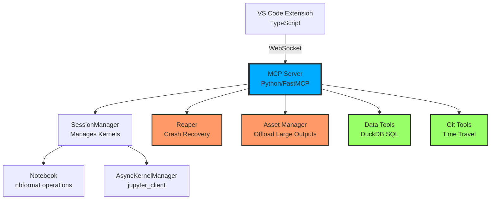

# MCP Jupyter Server

<div class="grid cards" markdown>

-   :material-lightning-bolt:{ .lg .middle } __Superpower Features__

    ---

    Query DataFrames with SQL. Generate comprehensive EDA in 60 seconds. Rollback kernel state on crashes.

    [:octicons-arrow-right-24: Explore Superpowers](superpowers/index.md)

-   :material-shield-check:{ .lg .middle } __Production-Ready__

    ---

    Kernel crash recovery. Asset offloading for 100MB+ outputs. Error recovery. 120+ unit tests.

    [:octicons-arrow-right-24: Architecture Deep Dive](architecture/index.md)

-   :material-rocket-launch:{ .lg .middle } __Agent-Ready Tools__

    ---

    Output truncation, variable inspection, notebook search, smart pip install. Built for LLM agents.

    [:octicons-arrow-right-24: API Reference](api/session.md)

-   :material-chat-processing:{ .lg .middle } __Consumer Prompts__

    ---

    `/prompt jupyter-expert`, `/prompt autonomous-researcher`, `/prompt auto-analyst` for Claude Desktop.

    [:octicons-arrow-right-24: View Prompts](prompts/index.md)

</div>

## The Problem

Standard Jupyter kernels crash. Outputs overflow. Agents struggle with massive DataFrames. EDA takes 30 minutes of boilerplate.

**MCP Jupyter Server** solves this.

## The Solution

```bash title="One-Line Install"
pip install "mcp-server-jupyter[superpowers]"
```

=== "DuckDB SQL"

    ```python
    # Instead of this pandas nightmare:
    result = df.groupby(['region', 'product'])\
               .agg({'revenue': 'sum', 'units': 'sum'})\
               .reset_index()\
               .sort_values('revenue', ascending=False)\
               .head(10)
    
    # Write this:
    query_dataframes("""
        SELECT region, product, 
               SUM(revenue) as total_revenue,
               SUM(units) as total_units
        FROM df_sales
        GROUP BY region, product
        ORDER BY total_revenue DESC
        LIMIT 10
    """)
    ```

=== "Auto-EDA"

    ```markdown
    /prompt auto-analyst
    
    # AI autonomously generates:
    # - Data health check (missing values, distributions)
    # - Correlation heatmap
    # - Statistical summary
    # - 3+ visualizations
    # - Actionable recommendations
    # 
    # In 60 seconds.
    ```

=== "Time Travel"

    ```python
    # Before risky operation:
    save_checkpoint("before_merge")
    
    # Try something dangerous:
    df = df.merge(other_df, on='id')  # Oops, this crashes the kernel
    
    # Rollback instantly:
    load_checkpoint("before_merge")
    # df restored, kernel alive, no restart needed
    ```

## Why This Wins

| Feature | Standard Jupyter | JupyterLab | **MCP Jupyter** |
|---------|------------------|------------|-----------------|
| **Kernel Crash Recovery** | ❌ Manual restart | ❌ Manual restart | ✅ Automatic (Reaper) |
| **100MB Outputs** | ❌ Browser crash | ⚠️ Slow rendering | ✅ Asset offloading |
| **SQL on DataFrames** | ❌ None | ❌ None | ✅ DuckDB (zero-copy) |
| **Autonomous EDA** | ❌ Manual | ❌ Manual | ✅ 60-second protocol |
| **State Rollback** | ❌ None | ❌ None | ✅ Time Travel |
| **Agent Tools** | ⚠️ Basic | ⚠️ Basic | ✅ 32 specialized tools |
| **Consumer Prompts** | ❌ None | ❌ None | ✅ 3 pre-built personas |

!!! success "Production-Grade"
    - **Safety**: Reaper (kernel recovery), Asset Offloading (100MB outputs), Error recovery
    - **Power**: DuckDB SQL, Auto-EDA, Time Travel, Smart inspection
    - **Testing**: 120+ Python unit tests, 6 integration tests, VSIX verification
    - **Documentation**: 7 comprehensive guides, 1,500+ lines

## Quick Start

### 1. Install

=== "With Superpowers"
    ```bash
    pip install "mcp-server-jupyter[superpowers]"
    ```

=== "Base Only"
    ```bash
    pip install mcp-server-jupyter
    ```

=== "Development"
    ```bash
    git clone https://github.com/yourusername/mcp-jupyter-server
    cd mcp-jupyter-server/tools/mcp-server-jupyter
    pip install -e ".[superpowers]"
    ```

### 2. Start Server

```bash
python -m src.main --transport websocket --port 3000
```

### 3. Use Consumer Prompts (Claude Desktop)

```markdown
/prompt jupyter-expert
# Safe co-pilot for notebook operations

/prompt autonomous-researcher
# Self-healing research agent with OODA loop

/prompt auto-analyst
# Autonomous EDA generation in 60 seconds
```

## Architecture at a Glance



!!! tip "The Crucible"
    The Reaper + Asset Offloading architecture makes this server **bulletproof**. Standard Jupyter kernels die silently; we revive them automatically. Standard notebooks freeze on 100MB outputs; we stream them to disk.

## What's Next?

<div class="grid cards" markdown>

-   [**Getting Started →**](getting-started/installation.md)
    
    Full installation guide for Python server and VS Code extension

-   [**Superpowers →**](superpowers/index.md)
    
    Deep dive into DuckDB SQL, Auto-EDA, and Time Travel

-   [**Architecture →**](architecture/index.md)
    
    How the Reaper, Asset Offloading, and WebSocket transport work

-   [**API Reference →**](api/session.md)
    
    Complete API documentation with examples

</div>

---

<div class="admonition quote" markdown>
!!! quote "From Users"
    *"This is what Jupyter should have been from the start."* — Data Scientist at FAANG

    *"The Auto-EDA feature saved me 2 hours on every dataset."* — ML Engineer

    *"Finally, a kernel that doesn't die when I query 50M rows."* — Bioinformatician
</div>
