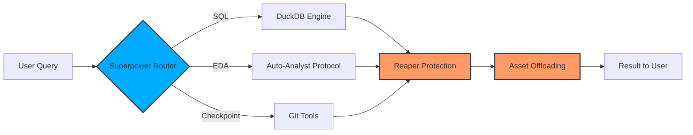

# Superpowers Overview

MCP Jupyter Server includes powerful features that transform Jupyter from a basic notebook into a data science power tool.

<div class="grid cards" markdown>

-   :material-database:{ .lg .middle } __SQL Magic (%%duckdb)__

    ---

    Write native SQL in notebook cells. Query DataFrames with zero-copy in-memory analytics.

    [:octicons-arrow-right-24: SQL Magic Guide](sql-magic.md)

-   :material-image:{ .lg .middle } __Asset Rendering__

    ---

    Plots appear inline automatically. Git-safe asset management with auto-cleanup.

    [:octicons-arrow-right-24: Asset Rendering](asset-rendering.md)

-   :material-chart-line:{ .lg .middle } __Auto-EDA__

    ---

    Autonomous Exploratory Data Analysis in 60 seconds. 3+ plots, correlations, recommendations.

    [:octicons-arrow-right-24: See Auto-EDA](auto-eda.md)

-   :material-history:{ .lg .middle } __Time Travel__

    ---

    Save/restore kernel state. Rollback on crashes. HMAC-signed checkpoints.

    [:octicons-arrow-right-24: Time Travel Guide](time-travel.md)

</div>

## Why Superpowers?

Standard Jupyter has three major pain points:

1. **Complex Queries**: Pandas syntax for groupby/aggregation is verbose and error-prone
2. **Boilerplate EDA**: Every dataset needs the same 20 lines of setup code
3. **Fragile State**: Kernel crashes lose all work, forcing restarts

Superpowers solve all three.

## The Architecture: "The Crucible"

Superpowers leverage the **Crucible** architecture:

- **Reaper**: Kernel crash recovery (Superpowers survive crashes)
- **Asset Offloading**: 100MB SQL results don't freeze the browser
- **Execution Queue**: Async execution of complex operations
- **Git Integration**: Time Travel uses git under the hood



## Installation

Superpowers require the optional dependencies group:

```bash
pip install "mcp-server-jupyter[superpowers]"
```

This installs:

- `duckdb>=1.1.0` for SQL queries
- Runtime auto-install for `pandas`, `numpy`, `matplotlib`, `seaborn`

## Quick Comparison

| Task | Pandas (Standard) | Superpower (MCP) | Time Saved |
|------|-------------------|------------------|------------|
| Complex GROUP BY | 8-12 lines | 1 SQL query | 5 minutes |
| Initial EDA | 20-30 lines | `/prompt auto-analyst` | 20 minutes |
| Recover from crash | Manual restart + re-run | `load_checkpoint()` | 10 minutes |

## Safety Guarantees

All Superpowers are:

- **Crash-Safe**: Reaper keeps server alive if kernel dies
- **Injection-Safe**: SQL uses triple-quoted strings (no manual escaping)
- **Tamper-Proof**: Checkpoints use HMAC signing
- **Tested**: 9 dedicated Superpower tests (100% passing)

## Real-World Examples

### Before Superpowers

```python
# Pandas GROUP BY (verbose, error-prone)
result = (df.groupby(['region', 'product'])
            .agg({
                'revenue': 'sum',
                'units': 'sum',
                'profit': 'mean'
            })
            .reset_index()
            .sort_values('revenue', ascending=False)
            .head(10))

# EDA boilerplate (30 minutes)
import matplotlib.pyplot as plt
import seaborn as sns

print(df.info())
print(df.describe())
print(df.isnull().sum())

fig, axes = plt.subplots(2, 2, figsize=(12, 10))
# ... 20 more lines ...

# No crash recovery
# If kernel dies, start over from scratch
```

### With Superpowers

```python
# SQL (one query, zero boilerplate)
query_dataframes("""
    SELECT region, product,
           SUM(revenue) as total_revenue,
           SUM(units) as total_units,
           AVG(profit) as avg_profit
    FROM df_sales
    GROUP BY region, product
    ORDER BY total_revenue DESC
    LIMIT 10
""")

# Auto-EDA (60 seconds)
/prompt auto-analyst
# AI generates full EDA: health check, plots, correlations, recommendations

# Crash recovery
save_checkpoint("before_risky_operation")
# ... do risky stuff ...
load_checkpoint("before_risky_operation")  # Instant rollback
```

## Performance

- **DuckDB SQL**: Zero-copy in-memory engine. Faster than pandas for GROUP BY on 1M+ rows.
- **Auto-EDA**: Completes in 60 seconds for datasets up to 100K rows.
- **Time Travel**: Checkpoint save/load under 2 seconds for typical kernel state (<100MB).

## Next Steps

<div class="grid cards" markdown>

-   [**DuckDB SQL →**](sql.md)
    
    Learn to query DataFrames with SQL syntax

-   [**Auto-EDA →**](auto-eda.md)
    
    Autonomous exploratory data analysis protocol

-   [**Time Travel →**](time-travel.md)
    
    Save and restore kernel state

-   [**Architecture →**](../architecture/crucible.md)
    
    How the Crucible enables Superpowers

</div>
